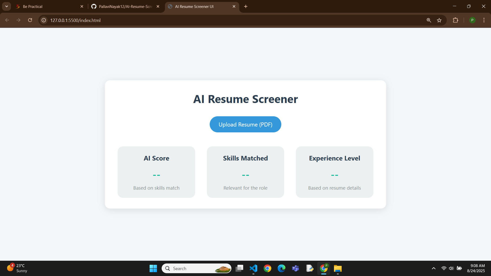

# AI Resume Screener UI

A **static AI Resume Screener UI** built using **HTML, CSS, and JavaScript**.  
This project simulates an AI-powered resume evaluation tool where users can upload a PDF resume, and the interface dynamically displays:

- **AI Score**
- **Skills Matched**
- **Experience Level**

> Note: This is a **frontend-only simulation**. No backend or real AI processing is involved. It’s designed to showcase a **modern, recruiter-friendly UI**.

---

## Features

- Sleek, clean, and responsive design  
- Upload PDF resume (filename displayed)  
- Dynamic AI Score, Skills Matched, and Experience Level after upload  
- Interactive UI with hover effects for cards  
- Fully static and easy to deploy

---

## Screenshot

  

---

## Demo Video

[![Watch the demo]](resume-screener-ui-demo.mp4)  
 

---

## How to Use

1. Open `index.html` in your browser  
2. Click **Upload Resume (PDF)**  
3. See the AI Score, Skills Matched, and Experience Level update dynamically  

---

## Tech Stack

- HTML  
- CSS  
- JavaScript  

---

## Deployment

You can host this project easily using **[GitHub Pages](https://pages.github.com/)**:

1. Upload all files to your GitHub repository  
2. Go to **Settings → Pages → Source → main branch / root**  
3. Open the generated URL to view the live project

---

## Author

**Pallavi Nayak**
